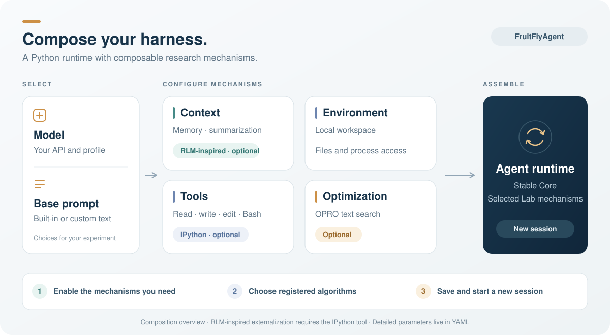
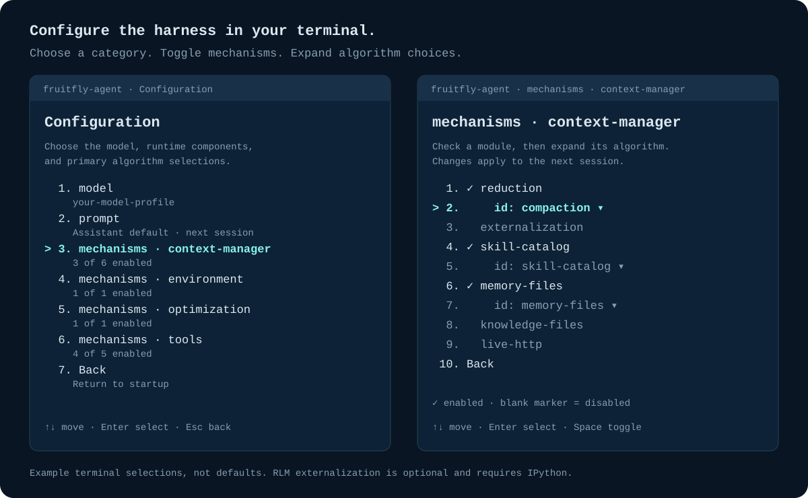

<p align="center">
  
</p>
<p align="center">
  
  
  <a href="LICENSE"></a>
</p>

# FruitFlyAgent

[Quickstart](#quickstart) · [Configuration](CONFIGURATION.md) · [Architecture](fruitfly_agent/README.md) · [RSI](fruitfly_agent/lab/rsi/README.md) · [Contributing](CONTRIBUTING.md)

**A lightweight Python agent harness for research into optimization and recursive self-improvement.**

Agent research needs a system you can understand, change, and test. FruitFlyAgent keeps the essential runtime in a small Python core, with replaceable algorithms in a pluggable Lab. Small, focused source files make mechanisms easy to inspect and modify, for both developers and coding agents.

Its Python runtime is adapted from [Pi](https://github.com/earendil-works/pi). [RLM-inspired programmatic context externalization](fruitfly_agent/lab/context_manager/externalization/programmatic_context/README.md) is one optional, pluggable Lab mechanism that you can enable for an experiment.

The research object is the **whole harness**: context, tools, execution, optimization, and adoption. Python and public extension contracts let you study these mechanisms in the same language as your experiments.

Named after **Thomas Hunt Morgan's fruit-fly research**, FruitFlyAgent uses simple systems to understand agent mechanisms. Our philosophy is **simple systems, controlled changes, rapid validation, repeatable observation, and respect for anomalous evidence**:

- Inspect before changing; take small, clear, reversible steps.
- Test a specific hypothesis against a baseline; change one factor at a time.
- Prefer quick, inexpensive checks; repeat important findings and keep them reproducible.
- Investigate failures and anomalies; revise explanations when evidence disagrees.
- Separate observations from hypotheses. Verify outcomes and report evidence, limits, and uncertainty.

Our ambition is **recursive self-improvement (RSI)**: agents that improve their own harness and improvement process through independently verified changes. FruitFlyAgent separates generation, evaluation, verification, and adoption so each step can be studied and tested.

## Built for harness research

| Design choice | Why it matters |
|---|---|
| Stable Core, pluggable Lab, explicit Catalog assembly | Replace tools, context strategies, execution backends, or search algorithms through public contracts; keep the change identifiable. |
| Target-owned trial adapters and injected search services | Separate what changes from how candidates are generated and evaluated; supply model roles, evaluators, and budgets explicitly. |
| Frozen search inputs, candidate journals, and runtime manifests | Bind comparisons to a baseline, tasks, policy, and execution identity; retain observations and check the actual runtime on recovery. |
| Separate proposal, verification, and adoption | Search results do not grant activation authority. Verification binds the candidate and policy before adoption. |
| Version-bound task and improver implementations | The RSI driver resolves the improver again after adoption, so the next generation can use an improved improvement process. |
| Explicit lifecycle and durable evolution phases | Own resource startup and cleanup; reconcile interrupted activation and avoid blindly replaying work with unknown cost. |

**Optimization and RSI serve different roles:**

| Capability | Role |
|---|---|
| [Optimization](fruitfly_agent/lab/optimization/README.md) | Search and compare candidates for a fixed target under a defined objective. It can run independently. |
| [RSI](fruitfly_agent/lab/rsi/README.md) | Verify and adopt changes to the system or its improver, then continue with the adopted implementation across generations. |

The built-in `/optimize` workflow searches prompt and guidance text. Broader harness experiments use the public mechanism contracts and researcher-supplied evaluators, version bindings, and adoption hosts. The generic RSI driver accepts host-bound implementation references; the built-in durable Run host handles text artifacts. See [Lab](fruitfly_agent/lab/README.md#optimization-and-rsi) for these implementation boundaries. Runtime manifests record declared identities; reproducible research also needs source and learning-state records.

| At a glance | Details |
|---|---|
| Version | 0.1 |
| Runtime | Python 3.11+, macOS or Linux (POSIX) |
| Model APIs | Anthropic Messages and OpenAI Responses |
| License | [MIT](LICENSE) · [Third-party notices](THIRD_PARTY_NOTICES.md) |

## Quickstart

Download the source and run these commands from the project root:

```bash
python3 -m venv .venv
.venv/bin/python -m pip install -e .
cp models.example.yaml models.yaml
cp .env.example .env
# Fill in your model ID, API endpoint, limits, and capabilities in models.yaml.
# Keep the profiles you need and set MODEL_API_KEY in .env.
.venv/bin/python -m fruitfly_agent
```

Choose a model, then **Start new session**. Model requests use the network and may incur charges. Local tools run with your user permissions; use a dedicated workspace when trying unfamiliar tasks.

To explore the extension lifecycle without keys or network access:

```bash
.venv/bin/python -m examples.extensions.offline_guidance
```

Expected output: `Offline response: example-guidance is active.` The example registers a context mechanism and runs it through the Application in a temporary workspace. See the [walkthrough](examples/extensions/README.md).

## Choose your mechanisms

Use the terminal configuration menu to assemble the harness for your task or experiment. Select a model and base prompt, enable or disable mechanisms, and choose their registered algorithms. Context management, tools, environment, and optimization are configurable through the same interface.



*A composition overview. Mechanisms are selectable; RLM-inspired externalization is optional and requires the IPython tool.*



*Example terminal selections, not defaults. Use arrow keys to navigate, Space to toggle a mechanism, and Enter to expand its algorithm selector. A check mark means enabled; an unchecked mechanism remains available for a later experiment.*

For example, enable RLM-inspired externalization together with the IPython tool to inspect context through Python, or leave it disabled to study other context strategies. Configuration changes apply to a new session; active and resumed sessions retain their runtime identity. Edit YAML for detailed parameters. See [Configuration](CONFIGURATION.md) and [Terminal](fruitfly_agent/interactive/terminal/README.md) for controls and dependencies.

## What you can do

| Task | Start here |
|---|---|
| Install, run a task, or resume a session | [Getting started](GETTING_STARTED.md) |
| Choose models, prompts, and mechanisms | [Configuration](CONFIGURATION.md) |
| Use terminal commands and menus | [Terminal](fruitfly_agent/interactive/terminal/README.md) |
| Inspect externalized context through Python | [Programmatic context](fruitfly_agent/lab/context_manager/externalization/programmatic_context/README.md) |
| Add an algorithm | [Lab](fruitfly_agent/lab/README.md) · [Offline extension example](examples/extensions/README.md) |
| Investigate and optimize harness mechanisms | [Lab](fruitfly_agent/lab/README.md#optimization-and-rsi) · [Optimization](fruitfly_agent/lab/optimization/README.md) |
| Verify, adopt, and continue across harness or improver versions | [RSI](fruitfly_agent/lab/rsi/README.md) |
| Run external benchmarks | [Eval](eval/README.md) |
| Develop and test | [Contributing](CONTRIBUTING.md) · [Tests](tests/README.md) |

## Project layout

| Directory | Responsibility |
|---|---|
| [fruitfly_agent/](fruitfly_agent/README.md) | Runtime architecture and module entry points |
| [eval/](eval/README.md) | Optional benchmark execution and reports |
| [examples/](examples/README.md) | Runnable extensions and optimization task packs |
| [tests/](tests/README.md) | Offline contract, architecture, and behavior checks |
| [AGENTS.md](AGENTS.md) | Engineering instructions for AI-assisted development |

## Contribute

Bring a focused mechanism, a reproducible experiment, or a failure that challenges an existing explanation. Include the conditions, observations, and limits needed for someone else to investigate it. Start with [Contributing](CONTRIBUTING.md) and the [engineering rules](AGENTS.md).

**AI-assisted development is welcome.** [AGENTS.md](AGENTS.md) defines the project rules coding agents should follow. Developers must actively guide the work: define the problem and research hypothesis, question proposed designs, inspect the implementation, and verify the evidence. Human judgment and responsibility remain essential throughout development.

Run the offline checks from your source checkout:

```bash
.venv/bin/python -m unittest discover -s tests -t .
```

See [Tests](tests/README.md) for selected checks and [Lab](fruitfly_agent/lab/README.md#test-and-evaluate) for research evidence requirements.

## License

FruitFlyAgent is released under the [MIT License](LICENSE). See [Third-party notices](THIRD_PARTY_NOTICES.md) for attribution and upstream licenses.

## Acknowledgments

| Source | Contribution |
|---|---|
| [Pi](https://github.com/earendil-works/pi) | Runtime design and adapted Agent loop, Session, and tool infrastructure; code attribution and the upstream license are recorded in [Third-party notices](THIRD_PARTY_NOTICES.md). |
| [Prime Agent](https://github.com/PrimeIntellect-ai/prime-agent) | Inspiration for externalizing context into a programmable Python environment; see [Programmatic context](fruitfly_agent/lab/context_manager/externalization/programmatic_context/README.md). |

Research sources and the scope of each adaptation are documented in the corresponding algorithm modules.
